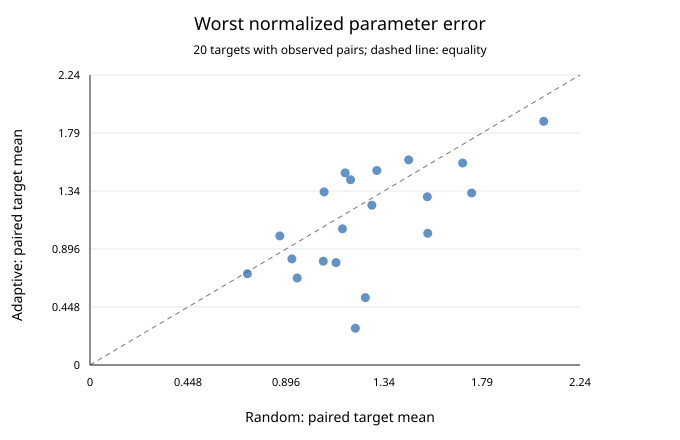
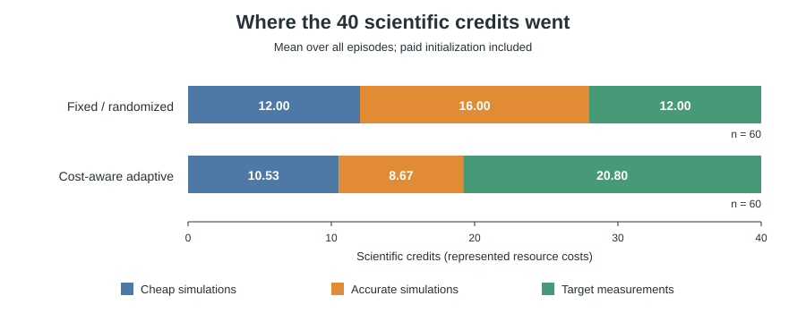

# Resource-planning toy: two-baseline CPU pilot

Completed 2026-09-11. All 120 frozen evaluation episodes produced valid
submissions, stayed within 40 scientific credits, and completed without execution
failures or timeouts. No LLM/API calls were made. The scientific source/test
hashes matched the development freeze before and after evaluation.

## Main result

Twenty uniformly sampled hidden targets, three policy seeds per target, and two
policies give 60 paired comparisons. Success requires **every** parameter to be
within 10% of its true value. The continuous error is the **maximum** of the
three relative errors divided by 0.1; an episode meets the requirement at error
at most one. It is not the mean of the three parameter errors.

| Policy | Successes | Success rate | Mean worst error | Median worst error | Mean credits | Mean elapsed seconds |
|---|---:|---:|---:|---:|---:|---:|
| Randomized nonadaptive | 17/60 | 28.3% | 1.26886 | 1.23176 | 40 | 1.325 |
| Cost-aware adaptive GP | 23/60 | 38.3% | 1.11566 | 1.15454 | 40 | 4.942 |

Paired target-cluster bootstrap (2,000 draws, seed 0), keeping the three policy
seeds together, gives these adaptive-minus-random differences:

- Success rate: **+10.0 percentage points**, 95% interval **-3.3 to +23.4**.
- Mean worst error: **-0.15320**, 95% interval **-0.29097 to -0.01739**.
- Elapsed time: +3.618 seconds, 95% interval +2.790 to +4.645.

The adaptive policy has lower average error in this pilot, but the success-rate
difference is not conclusive. Both still fail the accuracy requirement frequently:
43 fixed-policy and 37 adaptive-policy episodes. These are completed scientific
failures, not software failures. Of 60 matched pairs, 13 succeed only adaptively,
7 only with the fixed policy, 10 with both, and 30 with neither. These are 20
independent target draws, not 60 independent systems.



## What the policies purchased

Both pay for the same four low-fidelity and one high-fidelity initialization
runs. All numbers below include that initialization. The fixed policy always
buys 12 low-fidelity runs, 2 high-fidelity runs, and 1 additional target scalar.

| Adaptive allocation: low / high / measurements | Episodes |
|---|---:|
| 8 / 1 / 2 | 44 |
| 20 / 1 / 1 | 11 |
| 12 / 2 / 1 | 5 |

Thus its resource allocation varies, but it chooses no high-fidelity purchase
beyond the common warm start in 55/60 episodes. This pilot does not establish
that all three resource types require extensive adaptive use. The comparison
also combines choosing resource types with choosing their locations; it is not
a clean causal isolation of budget splitting alone.



Mean normalized component errors for theta1/theta2/theta3 were
`0.6101 / 0.7880 / 0.9753` for the fixed policy and
`0.4473 / 0.6161 / 1.0080` for the adaptive policy. The third parameter remains
the largest mean component error; lower overall worst error is not improvement
on every component.

### Illustrative traces

Every trace starts with `L,L,L,L,H` (12 credits). `L` is a cheap solve, `H` an
accurate solve, and `M(variable,time)` a target measurement. These examples are
the first pair with both failing, the first adaptive-only success, and the first
fixed-only success in evaluation order. Full parameters and returned data stay
in the local episode logs.

| Target / policy seed | Fixed worst error | Adaptive worst error | Adaptive actions after initialization |
|---|---:|---:|---|
| 2000 / 0 | 2.14828 | 1.93332 | M(x,4.0), then 16 L |
| 2001 / 1 | 1.07569 | 0.65296 | M(y,4.5), 3 L, M(x,4.5), L |
| 2003 / 0 | 0.91255 | 1.35487 | M(x,4.0), L, M(x,5.5), 3 L |

## Configuration and verification

The [protocol](resource_planning_toy_protocol.md) specifies the equations,
public/hidden interface, pricing, shared fitting backend, and MR-SUR-inspired
one-step policy. Key settings: noiseless target, Euler step 0.1, DOP853 tolerances
`1e-10/1e-12`, prices `1/8/12`, 40-credit cap, 2,048 prior particles, eight
hypothetical outcomes per action, and 300 seconds per episode. No baseline
parameters or resource prices were tuned against the evaluation targets.

Numerical validation used the debug case plus eight development targets:

- Maximum absolute DOP853/Radau disagreement: **6.03741e-8**, below `1e-6`.
- LF/HF relative trajectory RMSE ranged from **0.05375 to 0.11309**. This is
  pointwise-relative trajectory error, not parameter-estimation error.
- Rich-observation, unbudgeted recovery succeeded from all **72/72** optimizer
  starts. This is a privileged recoverability diagnostic, not a third baseline
  or evidence that recovery is always possible within 40 credits.
- Sparse-observation diagnostics retained alternative near-exact fits. A
  regression explicitly demonstrates two different parameter vectors matching
  `x(1), y(1), y(4)`; one additional observation does not guarantee uniqueness.
  Their 10%-acceptable answer regions can overlap, so this does not prove
  tolerance-level recovery impossible.
- **199 tests pass**: 185 shared-package tests and 14 preserved planning tests.
  Coverage includes GP conditioning against dense calculations, scientific
  accounting, scoring boundaries, full-trajectory caching, failed-work charges,
  deadline supervision, private/public separation, and offline reporting.

The development comparison was 3/8 successes for the fixed policy versus 5/8
for the adaptive policy. It was repeated to include the final identifiability
regression in the freeze; the scientific policies and results were unchanged.
Earlier debug/development outputs were retained. The 120-episode evaluation was
run once. No solver, policy, or test file changed during it.

Software: Python **3.13.5**, NumPy **2.3.4**, SciPy **1.16.1**, Windows CPU,
single-thread BLAS workers. Runtime includes process startup and is not the
scientific cost model. [Committed provenance](assets/resource_planning/provenance.json)
contains all 41 scientific source/test/config hashes, software versions, the
completion record, summary hash, and figure hashes. Freeze digest:
`948dae2f42c10237a47f4b11b0c098ef835681c0af7287aec471c65e3b3d80a9`.

## Reproduce and inspect

From the repository root, using the editable NumPy/SciPy install:

```powershell
python -m budgeted_science.resource_planning.validate --sparse-ambiguity
python -m budgeted_science.resource_planning.experiment --phase debug
python -m budgeted_science.resource_planning.experiment --phase development
# Substitute the new development directory printed by the preceding command:
python -m budgeted_science.resource_planning.experiment freeze <development-run> --output <development-run>/freeze.json
python -m budgeted_science.resource_planning.experiment --phase pilot --freeze <development-run>/freeze.json
python -m budgeted_science.resource_planning.reporting <pilot-run> --output-dir tmp/regenerated_report
python docs/render_resource_planning_figures.py <pilot-run> --output-dir tmp/curated_figures
python -m unittest discover -s tests -q
python -m unittest discover -s demos/planning/tests -q
```

The experiment commands create new directories; they never replace older runs.
Offline reporting and the documentation renderer require only saved evidence.
The CPU environment does not load the OpenAI SDK. Figure generation uses only
the Python standard library; local PNG previews were rendered with Sharp and
both final SVG figures visually inspected.

Canonical local evidence, relative to the repository:

- Validation: `demos/planning/runs/resource_planning/20260911T093315Z-validation-22ff916734/`.
- Frozen development: `demos/planning/runs/resource_planning/20260911T093720Z-development-0151564941/`.
- Evaluation and all 120 episode logs: `demos/planning/runs/resource_planning/20260911T094128Z-pilot-463f2ae408/`.

Each evaluation attempt retains a manifest, append-only events, full purchased
trajectory artifacts including dense interpolation coefficients, action scores,
GP diagnostics, submission, private evaluation, and ledger. The experiment root
holds the freeze, complete outcome index, completion record, and derived report.
Reports were independently regenerated byte-for-byte without rerunning tools.

## Interpretation limits

This establishes a working, objectively scored CPU decision problem and two
reproducible comparison points. It does not establish LLM performance, optimal
allocation, reliable confidence, or general scientific-planning ability. Both
methods share an approximate GP estimator with fitted hyperparameters, a finite
prior grid, and numerical variance floors. Those modeling choices can affect
acquisition decisions and final errors.

The pilot tests allocation among **fixed-price resources**, not unexpected
execution costs or efficient early stopping. All episodes spend all 40 credits;
no saving reward was provided. Equations and unpurchased observations are hidden
through trusted tool contracts, not a code-execution sandbox. The freeze verifies
checkout hashes before and after execution; it is not an immutable execution
snapshot. Existing Burgers code, agent runs, credential files, and proposal
documents were not changed, and no external push or API evaluation was performed.
